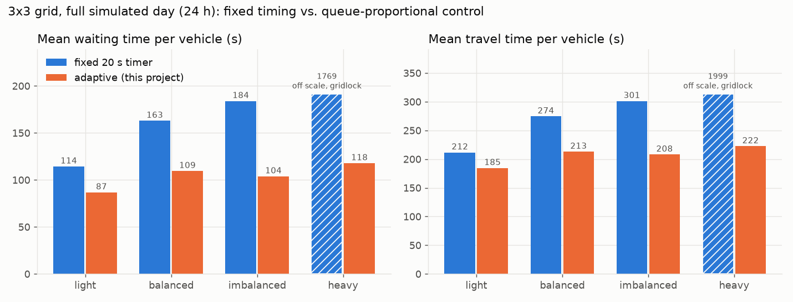
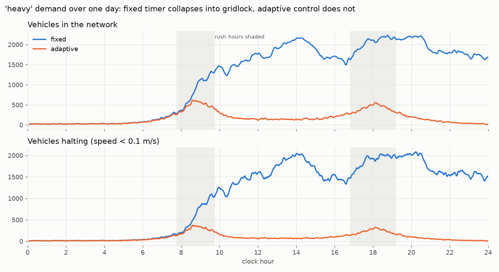
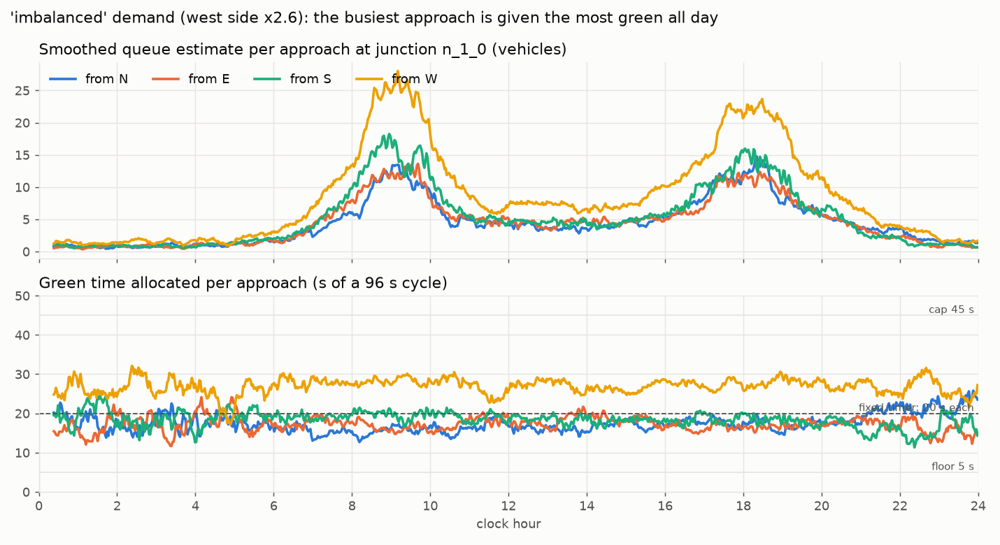
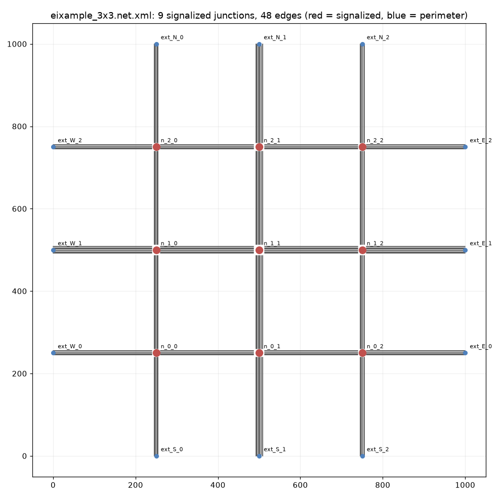
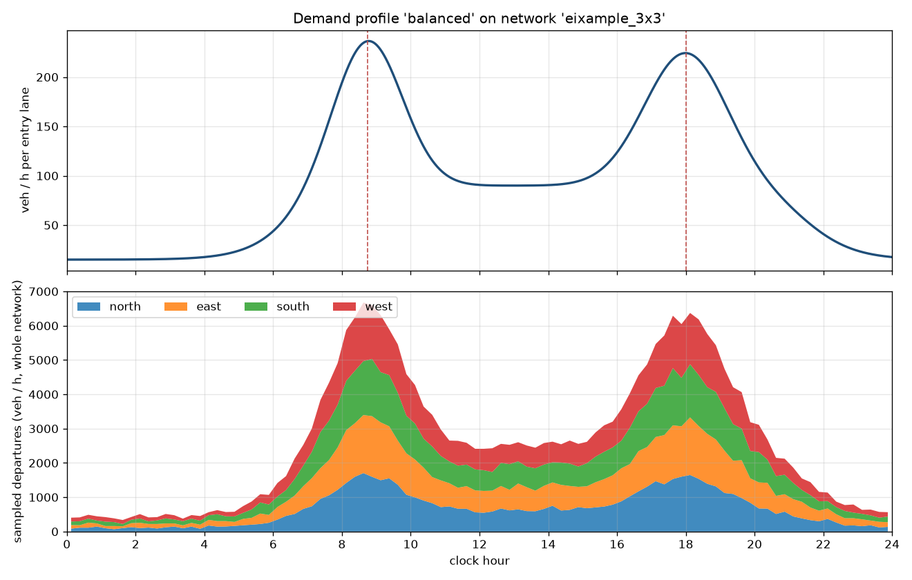
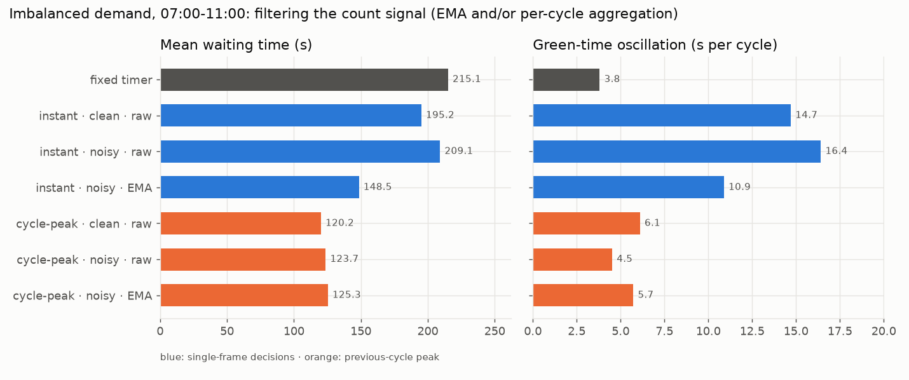
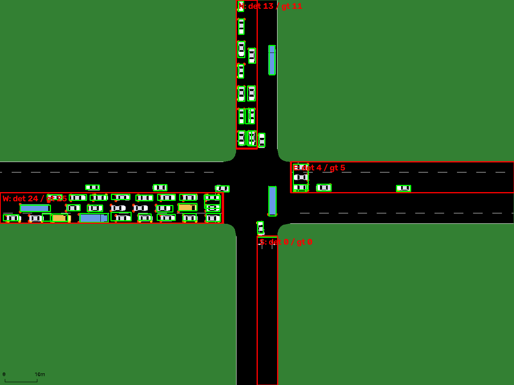

# Adaptive traffic signal control on a synthetic city

Queue-proportional traffic-light control, built and validated entirely inside
[SUMO](https://eclipse.dev/sumo/) on a made-up city with realistic rush-hour traffic.
Fixed-interval signals waste green time on empty approaches while congested ones
queue; this controller measures the queue on every approach and splits each cycle's
green time in proportion. A YOLOv6 stage on rendered simulation frames shows the
"vision" half is implementable; the control loop itself runs on simulator ground truth.

`PROJECT_CONTEXT.md` is the spec, `CLAUDE.md` the working conventions.

## Headline result



One full simulated day on a 3×3 signalised grid, four demand profiles, same
controller constants throughout (no per-scenario retuning):

| demand | fixed timer: mean wait | adaptive: mean wait | change | fixed teleports | adaptive teleports |
|---|---|---|---|---|---|
| light | 114 s | 87 s | −24 % | 0 | 0 |
| balanced | 163 s | 110 s | −33 % | 1 | 0 |
| imbalanced (west ×2.6) | 184 s | 104 s | −44 % | 0 | 0 |
| heavy | 1,769 s — gridlock, 18k vehicles never arrive | 118 s | — | 6,418 | 0 |



## How it works

```
SUMO (sumo / sumo-gui)
   │  halting vehicles per approach, every second (traci)          ← src/sim
   ▼
exponential smoothing, half-life 10 s                              ← src/smoothing
   │  peak of the smoothed queue over the previous cycle
   ▼
green_i = 5 s floor + (80 s budget − 4×5 s) · q_i / Σq, cap 45 s    ← src/controller (pure function)
   │  phase durations for the next 96 s cycle
   ▼
traci.trafficlight.setPhaseDuration  — every junction independently, no coordination
```



### The city (`src/citygen`)

Inspired by Barcelona's Eixample: a uniform two-way grid where every crossing is a
plain 4-way signal, with a 3-lane avenue through the middle in each direction and
2-lane streets elsewhere. Blocks are 250 m rather than the real 133 m because
uncoordinated signals on short blocks spill queues back into the upstream junction
(measured: gridlock at ~200 veh/h/lane). `configs/network_single.yaml` is the 1×1
case used for first tests.



Demand is a diurnal curve per entry lane — night floor, daytime plateau, Gaussian
rush hours at 08:45 and 18:00 — sampled as a non-homogeneous Poisson process, with
perimeter-to-perimeter trips routed by SUMO. Profiles: `light`, `balanced` (peak
240 veh/h/lane, the last level the fixed timer survives), `imbalanced` (same total,
skewed west), `heavy` (beyond fixed-timing capacity).



### Design decisions (all recorded in the configs)

| decision | choice | why |
|---|---|---|
| cycle length | fixed 96 s (4 × 20 s green + 4 × 4 s yellow/all-red) | identical budget to the baseline, so gains come only from *how* it is split |
| allocation | proportional with a 5 s floor and 45 s cap | no approach is ever starved; none can hog the cycle |
| smoothing | EMA, half-life 10 s | one knob, no warm-up, spike-resistant |
| what the controller sees | peak smoothed queue over the previous cycle | the instantaneous value is biased against the approach just served (wait 40 s → 30 s on the single junction) |
| signal scheme | one green phase per approach (N, E, S, W) | "green time per approach" maps 1:1 onto a phase |

### Why filter the signal at all

Ground-truth counts are noise-free, so on their own smoothing only adds lag. With
synthetic detector noise injected (occlusion misses, duplicates, frame drops, phantom
bursts — `configs/noise_detector.yaml`) the picture is:



Deciding on a single frame's count thrashes (15–16 s of green change per cycle) and
forfeits most of the gain; on a noisy signal the EMA cuts oscillation by a third and
wait by 29 %. Aggregating over the whole previous cycle is a stronger filter still,
and is the default.

### Detection proof-of-concept (`src/detection`)

Frames come from sumo-gui via traci (top-down "real world" scheme, 0.125 m/px),
with per-approach ground-truth counts and, for training, a box for every visible
vehicle computed from traci position/heading/size. Lane ROIs are derived from the
network geometry. The COCO-pretrained `yolov6n` detects **nothing** on these
sprites (0 of 1,508 vehicles on a held-out set), so the model is fine-tuned on
280 auto-labelled frames (15 epochs, ~17 min on CPU, mAP@0.5 = 0.69 on the
validation split). On a held-out junction and time not used for training
(40 frames, 1,508 vehicle instances), detected counts per approach vs. traci:

| approach | mean ground truth | mean detected | MAE (vehicles) | bias | correlation |
|---|---|---|---|---|---|
| N | 8.3 | 9.4 | 1.1 | +1.1 | 0.98 |
| E | 6.1 | 7.0 | 1.2 | +0.9 | 0.94 |
| S | 4.6 | 5.9 | 1.3 | +1.3 | 0.98 |
| W | 18.8 | 18.9 | 1.0 | +0.2 | 0.98 |
| **all** | 9.4 | 10.3 | **1.1** | +0.9 | **0.98** |



Green boxes are detections, red boxes the geometry-derived approach ROIs with
detected / ground-truth counts. The slight over-count is vehicles straddling the
stop line. This stage demonstrates the vision component is implementable; it is
deliberately not wired into the control loop, which runs on ground truth.

## Demo

```bash
pip install -r requirements.txt
python scripts/setup_sumo_path.py        # once: makes sumolib/traci importable + IDE-resolvable
python scripts/demo.py watch             # sumo-gui, 3x3 grid, imbalanced morning peak, adaptive control
python scripts/demo.py compare           # fixed vs adaptive on the same window, prints a table
```

`watch --control fixed` shows the baseline for contrast; `--network single` uses one
intersection (its `compare` takes about a minute: wait 112 s → 31 s).

## Running it

```bash
pytest tests/                                                                 # 91 tests

python -m src.citygen --network configs/network_eixample.yaml --demand configs/demand_balanced.yaml
python scripts/plot_demand.py --network configs/network_eixample.yaml --demand configs/demand_balanced.yaml
sumo-gui -c sumo_scenarios/eixample_3x3__balanced.sumocfg                     # fixed-timing baseline, visual check

python -m src.sim --scenario sumo_scenarios/eixample_3x3__balanced.sumocfg --control adaptive
python -m src.sim --scenario sumo_scenarios/eixample_3x3__balanced.sumocfg --control adaptive --gui --begin 25200 --end 39600
python scripts/run_experiments.py --modes fixed adaptive                      # full-day matrix (~30 min)
python scripts/run_experiments.py --demands imbalanced --modes adaptive adaptive_nosmooth --noise configs/noise_detector.yaml --aggregate instant --begin 25200 --end 39600
python scripts/plot_results.py                                                # docs/figures/*.png
```

`eclipse-sumo` bundles the SUMO binaries (including `sumo-gui`) with `sumolib`/`traci`;
`src/sumo_env.py` locates them, honouring `SUMO_HOME` if you have a separate install.
Generated scenarios and outputs live in `sumo_scenarios/` (git-ignored).

Detection extras (optional):

```bash
git clone --depth 1 https://github.com/meituan/YOLOv6 external/YOLOv6
curl -L -o external/weights/yolov6n.pt https://github.com/meituan/YOLOv6/releases/download/0.4.0/yolov6n.pt
pip install torch torchvision --index-url https://download.pytorch.org/whl/cpu
pip install opencv-python scipy tqdm addict requests psutil tensorboard pycocotools

python scripts/build_detection_dataset.py                                     # 7 junction/time/zoom jobs → 280 labelled frames
PYTHONPATH=external/YOLOv6 TORCH_FORCE_NO_WEIGHTS_ONLY_LOAD=1 python external/YOLOv6/tools/train.py --data-path sumo_scenarios/output/detection/dataset/dataset.yaml --conf-file configs/yolov6n_sim_finetune.py --img-size 640 --batch-size 8 --epochs 15 --workers 0 --device cpu --eval-interval 5 --output-dir sumo_scenarios/output/detection/runs --name yolov6n_sim
python -m src.detection capture --scenario sumo_scenarios/eixample_3x3__imbalanced.sumocfg --tls n_1_0 --begin 33600 --warmup 240 --frames 40
python -m src.detection evaluate --weights sumo_scenarios/output/detection/runs/yolov6n_sim/weights/best_ckpt.pt --annotate
```

`TORCH_FORCE_NO_WEIGHTS_ONLY_LOAD=1` is needed because YOLOv6 checkpoints pickle whole
model objects, which recent PyTorch refuses by default. `external/` is never modified.

## Repository layout

```
src/citygen/      network + demand generator → sumo_scenarios/*.sumocfg
src/controller/   green-time allocation (pure, no simulator imports)
src/smoothing/    exponential moving average
src/sim/          traci bridge, per-junction cycle logic, synthetic detector noise
src/detection/    frame capture, ROIs, auto-labels, YOLOv6 wrapper, evaluation
configs/          YAML for network, demand profiles, controller, smoothing, noise; YOLOv6 fine-tune config
scripts/          plots, experiment matrix, dataset builder
tests/            one module per package (pytest)
docs/figures/     result figures used above
external/         vendored YOLOv6 + weights (git-ignored)
```
